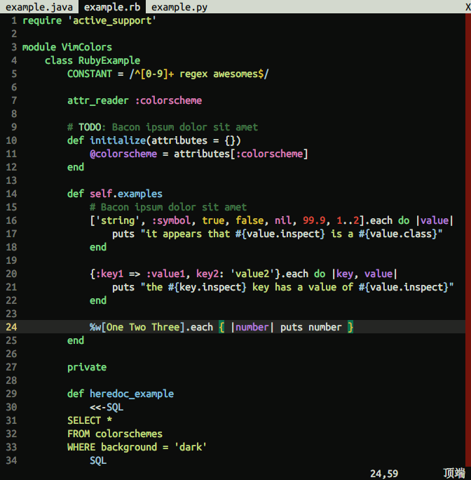
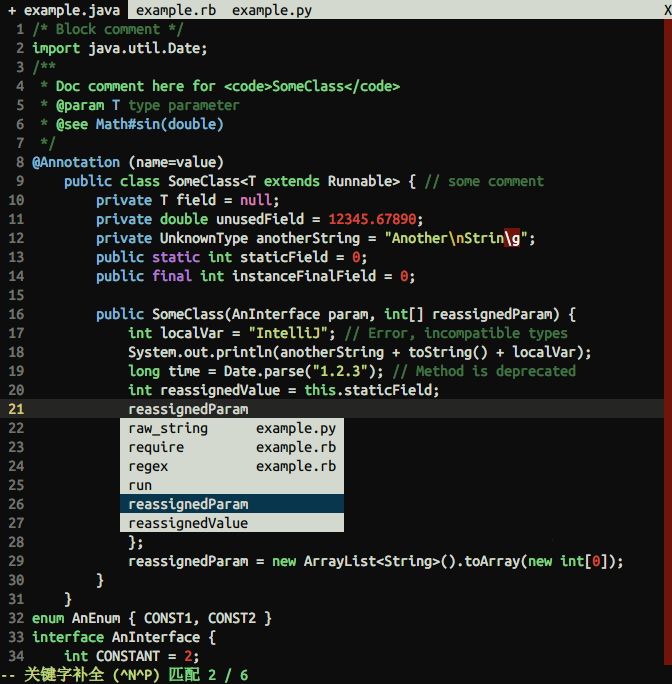
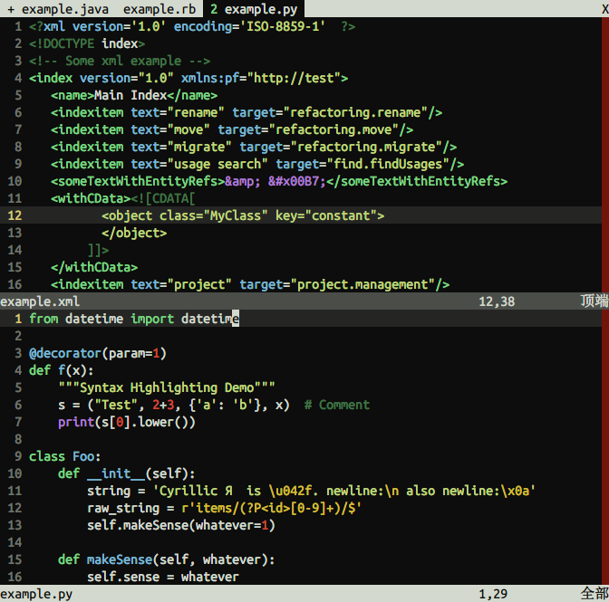
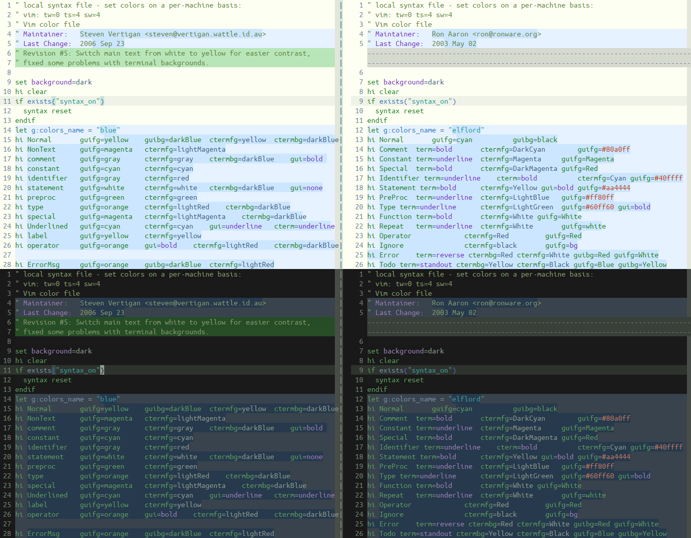

CandyPaper - Light Dark Color Scheme for Vim
================================================================================

CandyPaper provides light and dark color scheme for **Vim**.

See also: ["Candy Paper Color Table"](https://docs.google.com/spreadsheets/d/1v4NbZxSi4qxn7nStUBQCcnAlwZAlAkVvuDV5CeV8NX8/edit?usp=sharing).

## Installation
Just put 'CandyPaper.vim' into the 'colors' directory. Or use a bundle manager.

Then, add this into your `~/.vimrc`:

```VimL
    set background=light " or dark
    set termguicolors " or set t_Co=256 if not supported
    colorscheme CandyPaper
```

## Preview







